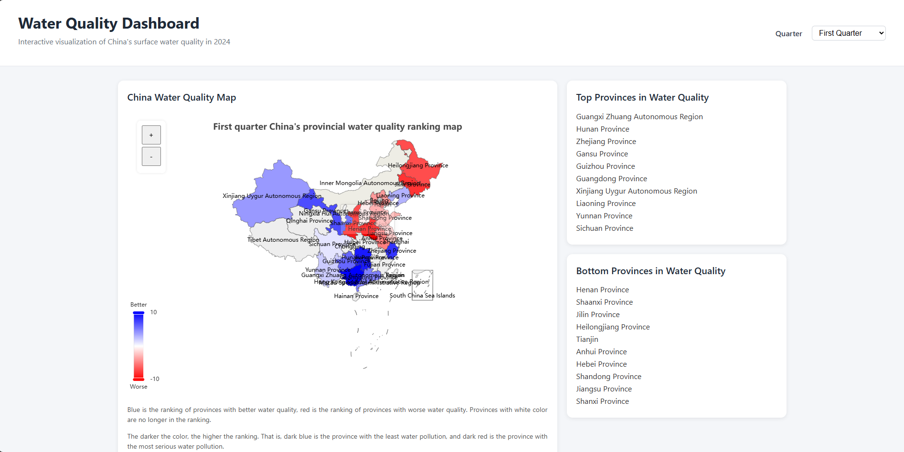
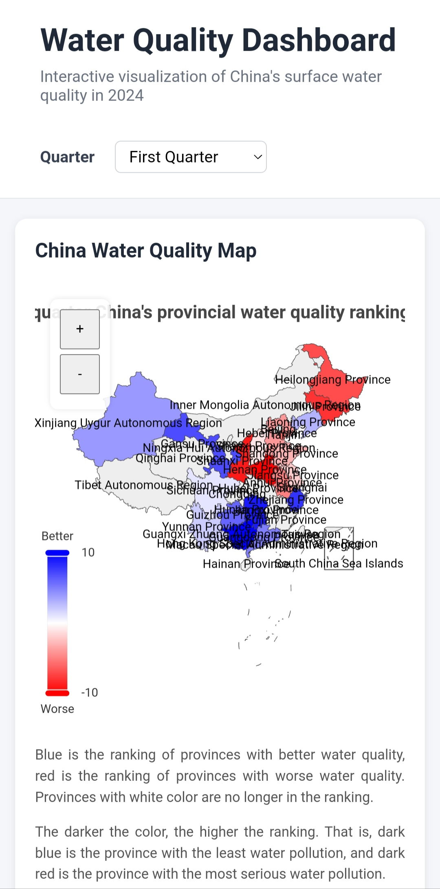

# Water Quality Visualization Dashboard

Interactive dashboard visualizing China's 2024 surface water quality data using JavaScript, ECharts and Chart.js.

## Deployment

The project is deployed using GitHub Pages.

Live Demo:

https://weibomeng.github.io/water-quality-visualization-dashboard/


## Project Overview

The Water Quality Visualization Dashboard is an interactive data visualization project that presents China's surface water quality data in 2024.

The dashboard allows users to explore provincial water quality rankings, compare different quarters, and view statistical information through interactive maps and charts.

The project has been improved into a portfolio-ready web application with better structure, deployment, and documentation.

## Features

- Interactive China map displaying provincial water quality rankings
- Quarterly water quality data filtering
- Dynamic ranking lists showing provinces with better and worse water quality
- Interactive data visualizations using charts
- Responsive layout supporting desktop and mobile devices
- Map zoom controls for better user interaction
- Local GeoJSON map data for reliable deployment

---

## Technologies Used

- HTML5
- CSS3
- JavaScript
- ECharts
- Chart.js
- GitHub Pages

## Project Structure

```text
water-quality-visualization-dashboard/
├── assets/
│   ├── china.json
│   └── screenshots/
│       ├── dashboard-desktop.png
│       └── dashboard-mobile.jpg
│
├── css/
│   └── style.css
│
├── js/
│   ├── app.js
│   ├── charts.js
│   ├── data.js
│   └── map.js
│
├── index.html
└── README.md
```

---

## Installation and Usage

### Run Locally

1. Clone this repository:

```bash
git clone https://github.com/WeiboMeng/water-quality-visualization-dashboard.git
```

2. Open `index.html` in a web browser.

No additional installation or dependencies are required.

---

## Screenshots

### Desktop View



### Mobile View



---

## Future Improvements

Possible future improvements include:

Adding more historical water quality datasets
Improving data filtering and comparison functions
Adding additional visualization methods
Connecting the dashboard with a backend API for dynamic data updates

---

## License

This project is licensed under the MIT License.
